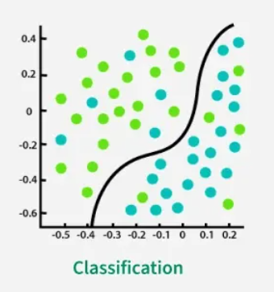
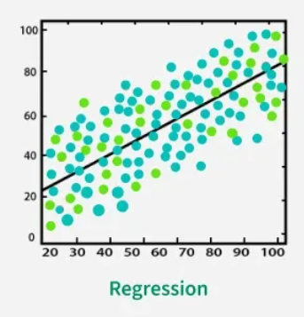

<!-- _class: centered-narrow -->
# Welcome!
--- 

<!-- _class: centered-narrow -->
# Have you ever felt
# like your training
# wasn't producing results?
<!-- Derya -->
<!-- Here we should ask the audience to involve it, maybe just with a hand raise -->

---

<!-- _class: centered-narrow -->

# If yes! Meet **Apex** 
## Your AI-powered personal trainer

<!-- Aaron -->

---

# **Apex**, maximizing
# your training

* **Aaron Ricca**
    * Electrical and computer engineering
    * Ex professional skier
    * Climber

* **Derya Özsoy**
    * Informatik
    * Kickboxing

<!-- Start Aaron -> Derya -->
<!-- AI personal trainer which Helps maximizing training results -->

---

# What's the problem ? 

* training is far from optimized
* hard to find good exercises
* time is always too little

<!-- Derya -->

---

# How does **Apex** work?
* the End User enters his **data**
* Apex learns with the collected **User data** and **data** from Internet and tries to find common patterns.
* At the end the User receives a personalized training plan
<!-- Derya -->
---
# Data time !

* ### Input attributes:
* Objective
* Available time
* Favorite exercises
* Biological attributes (Height, body fat%, medical condition, etc.)
* Alimentation (Cuisine, Diet type, enhancing substances, etc.)

* ### Output attributes:
* Training periodization
* List of exercises
* Alimentation improvement tips
* Corresponding improvement % [Continuous]

<!-- Aaron -->
<!-- corresponding improvement % -> diminishing returns-->
---

# Data Sources 📊

* ### Research & Literature 📚

  - Scientific papers
  * Studies & publications
  * Medical research

* ### Real-World Data 💪

  - Gyms & fitness centers
  * Professional coaches
  * Testers & athletes

* ### User-Generated 📱

  - Surveys & questionnaires
  * Smartwatch data
  * Fitness app tracking

* ### Continuous Growth 🔄

  -  Data collected from users

<!-- Aaron -->

---

# Data Preprocessing 🔧

* Convert different units & scales to SI units
  * Height (feet -> cm), Weight (lb -> kg), etc.

* **Standardization** → for classification algorithms (KNN, Random Forest)
* **Normalization** → for regression algorithms

<!-- Aaron -->
---

<!-- _class: centered-fit equalize-fit -->

### Few data?
* ### -> More data?
* ### 🧪 Synthetic data!

<!-- Aaron -->
---

# *SMOTE* 
### *S*ynthetic *M*inority *O*versampling *Te*chnique  

* Used for **imbalanced datasets**  
  → e.g., 90% fit people and 10% overweight  
* Problem: ML models **bias the majority class**  
* SMOTE **creates new synthetic data** of the minority class

<!--Aaron-->
---

# How SMOTE Works

<!-- _class: no-bullets -->

**Our scenario:** 10% overweight, 90% fit

* - -**User A:** Age 35, Weight 95kg, Beginner level
* - -**User B:** Age 40, Weight 100kg, Beginner level

* SMOTE finds two **similar overweight users** and creates a new realistic profile:

*  - -**Synthetic user C:** Age 37, Weight 97kg, Beginner level ✨

* ✅ Makes the minority class **denser and more balanced** (27%)
<!--Aaron-->
---
# What are we using for **Apex**

* **Supervised Learning**
  * trained using labeled training data
  * learns to recognize patterns in order to make predictions for new, unknown and similar data 
  * All Data are structured
      * Classification
      * Regression

<!-- Derya -->
---
# Tools

<!-- 

 --> 

### Classification 🎯
focuses on sorting observations into specific class
-> exp: We categorize some Data "*sick*" an "*healthy*" so that the user receives a training plan that does not harm his health

---

### Regression 🎯
Based on making prediction or identification of trends
-> exp: predict a good training plan for the User

---

### Algorithms 📈
* **Linear Regression**
  * Predict improvement percentages
  * Estimate workout outcomes
* **K-Nearest Neighbors (KNN)**
  * Find similar user profiles
  * Recommend based on comparable cases
* **Random Forests**
  * Robust decision-making
  * Handles complex non-linear relationships
  * Gradient Boosting 

---

### Data Processing 🔧
* **SMOTE** - Balance underrepresented groups
* **Cross-Validation** - Ensure model generalization
* **PCA (Principal component analysis)** - Reduce the data dimensionality

---

# Why is **Apex** better?
* **Open source** - Transparent algorithms, community improvements
* **Data-driven optimization** - Personalized vs generic programs
* **Lower injury risk** - Biomechanical constraints and progressive overload
* **First of its kind** - Novel ML-based personal training approach
* **Continuous learning** - Improves with more user data

<!-- Aaron -->
---
# Possible risks, barriers and obstacles
* **Incomplete data can lead to incorrect results.**
  * can lead to injuries due to incorrect training suggestions
* **Time and resources.**
  * Data must always be updated and maintained.
  * Possible data loss.
  * High costs und delays.
* **Data breach.**
<!--Too much data can overload the system or the app (the app may crash)-->

<!-- Derya -->
---

# Ethical Considerations
* **Privacy & GDPR compliance** - Sensitive biometric and health data
* **Labor market impact** - Potential displacement of personal trainers
* **Economic effects** - Reduced gym memberships
* **Algorithmic bias** - Training data skewed toward young, fit persons
  * Risk: Inappropriate recommendations for underrepresented groups
  * Can lead to injuries in elderly or different body types
* **Dual-use concerns** - Technology repurposed beyond original intent
  * Example: Military training

<!-- Both -->

---

<!-- _class: sources-compact -->
# Sources (1/2)

- Mainly class lectures
- Brownlee, Jason. ‘SMOTE for Imbalanced Classification with Python’. MachineLearningMastery.Com, 16 January 2020. https://www.machinelearningmastery.com/smote-oversampling-for-imbalanced-classification/.
- ChatGPT. ‘ChatGPT’. Accessed 26 September 2025. https://chatgpt.com/?locale=en-US.
- Dorogush, Anna Veronika, Vasily Ershov, and Andrey Gulin. ‘CatBoost: Gradient Boosting with Categorical Features Support’. arXiv:1810.11363. Preprint, arXiv, 24 October 2018. https://doi.org/10.48550/arXiv.1810.11363.

- ‘Explainable Boosting Machine — InterpretML Documentation’. Accessed 26 September 2025. https://interpret.ml/docs/ebm.html?utm_source=chatgpt.com.
- ‘Gradient Boosting Trees vs. Random Forests | Baeldung on Computer Science’. 25 February 2022. https://www.baeldung.com/cs/gradient-boosting-trees-vs-random-forests.

---

<!-- _class: sources-compact -->
# Sources (2/2)

- Moronta, Sendoa. ‘Generating, Comparing and Evaluating Synthetic Tabular Data with SDV’. Medium, 18 September 2025. https://medium.com/@sendoamoronta/generating-comparing-and-evaluating-synthetic-tabular-data-with-sdv-1198e97c8603.
- Ph.D, Davide Gazzè-. ‘SDV: Generate Synthetic Data Using GAN and Python’. Medium, 30 March 2023. https://medium.datadriveninvestor.com/sdv-generate-synthetic-data-using-gan-and-python-4c26a1e4b3c2.

- Step By Step Data Science. ‘LightFM Tutorial for Creating Recommendations in Python’. Accessed 26 September 2025. https://www.stepbystepdatascience.com/hybrid-recommender-lightfm-python.
- Wikipedia. ‘Cross-validation (statistics)’. 30 September 2025. https://en.wikipedia.org/w/index.php?title=Cross-validation_(statistics)&oldid=1314208627.
- Wikipedia. ‘Synthetic minority oversampling technique’. 22 August 2025. https://en.wikipedia.org/w/index.php?title=Synthetic_minority_oversampling_technique&oldid=1307265510.

--- 

# Apex: Any questions?

We're happy to dive deeper.

"https://github.com/Rin-Ha-n/AppliedAI/blob/development/Presentation/Presentation.pdf"

